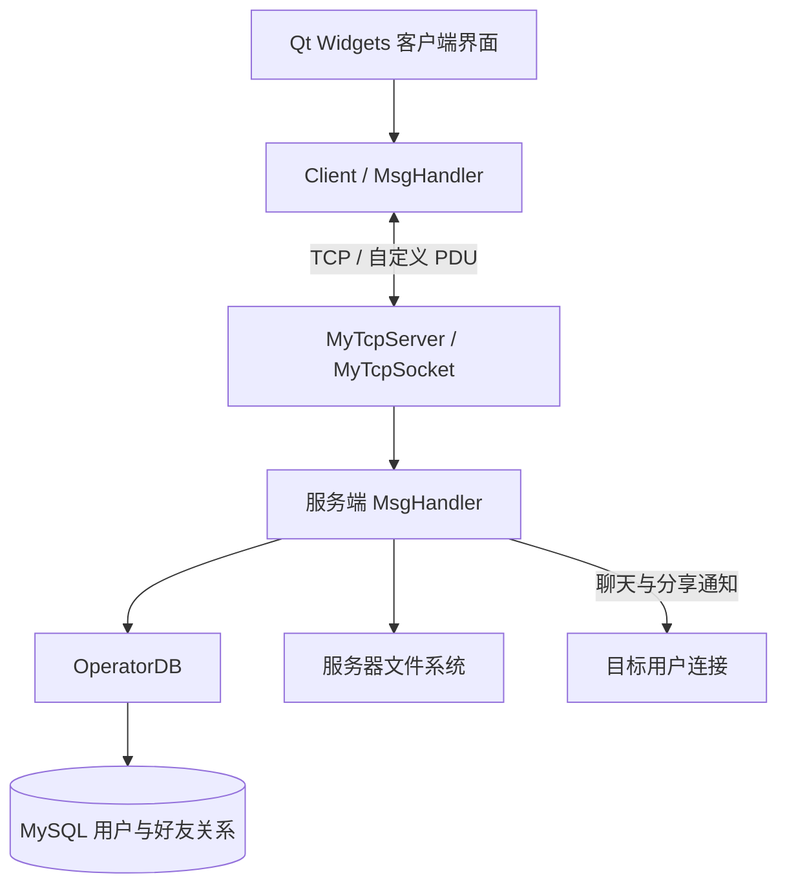

<div align="center">


# CloudStorage

**基于 Qt Widgets 的桌面云盘项目，将文件管理、好友互动和 TCP 通信串在一起。**


[功能概览](#功能概览) · [系统架构](#系统架构) · [准备环境](#准备环境) · [源码导航](#源码导航)

</div>

## 功能概览

仓库包含 Qt 客户端和服务端两套独立工程。客户端提供登录、好友和文件界面；服务端处理连接、转发消息、访问 MySQL，并把用户文件保存在服务器文件系统中。

| 文件管理 | 好友互动 | 基础能力 |
| --- | --- | --- |
| 目录浏览、创建与删除 | 查找用户、好友邀请与接受 | 用户注册、登录与在线状态 |
| 文件重命名、移动、上传和下载 | 在线用户列表、好友列表与删除 | Qt 信号与槽、TCP 连接管理 |
| 向好友分享普通文件 | 好友聊天 | 自定义 PDU 与接收缓冲处理 |

分享接收方确认后，服务端将普通文件复制到其用户目录。目录分享的复制分支尚未实现，不能视为支持完整文件夹分享。

## 系统架构



### 一次操作经过哪些层

1. 界面的按钮或列表操作创建 PDU，写入消息类型、参数与可变长度数据。
2. 客户端通过 `QTcpSocket` 发送，服务端按消息类型分派给业务处理器。
3. 用户与好友操作访问数据库；文件操作使用 `QFile`、`QDir` 等访问服务器磁盘。
4. 响应返回客户端，界面处理器更新列表、显示结果或继续传输数据。

两端接收逻辑都维护字节缓冲区，根据 PDU 长度判断是否收到完整消息，再逐条处理。协议直接使用 C++ 结构体布局，跨平台联调时需要核对布局、长度和字节序约定。

<details>
<summary><strong>PDU 字段速览</strong></summary>

| 字段 | 用途 |
| --- | --- |
| `uiPDULen` | 整个协议数据单元的长度 |
| `uiMSgLen` | 可变消息数据的长度 |
| `uiMSGType` | 请求或响应的类型 |
| `Parameter[64]` | 业务参数区 |
| `MSG[]` | 可变长度消息或文件数据 |

协议定义分别位于 [Client/protocol.h](Client/protocol.h) 与 [Server/protocol.h](Server/protocol.h)。文件数据按块传输，业务消息与文件数据使用不同的消息类型。

</details>

## 准备环境

### 工程与依赖

| 工程 | 项目文件 | Qt 模块 |
| --- | --- | --- |
| 客户端 | [Client.pro](Client/Client.pro) | Core、Gui、Widgets、Network |
| 服务端 | [Server.pro](Server/Server.pro) | Core、Gui、Widgets、Network、Sql |

两端使用 qmake 项目和 C++11。准备 Qt Creator、匹配的 Qt Kit 和编译器；服务端还需 MySQL，以及该 Qt Kit 可加载的 `QMYSQL` 驱动。

服务端入口同样使用 `QApplication`，不是纯命令行守护进程。部署到无图形环境时，需要另行核对 Qt 平台插件与运行环境。

### 配置清单

| 配置 | 格式与注意事项 |
| --- | --- |
| [Client/client.config](Client/client.config) | 第一行为服务器 IP，第二行为端口 |
| [Server/server.config](Server/server.config) | 第一行为监听 IP，第二行为端口，第三行为文件存储根目录 |
| [OperatorDB](Server/operatordb.cpp) | 数据库连接参数与用户、好友关系查询；仓库未附数据库初始化 SQL |
| [客户端文件视图](Client/file.cpp) | 用户起始路径使用 `./filesys/<用户名>`，需要与服务端根目录及工作目录保持一致 |

**连接配置通过 `config.qrc` 嵌入程序。** 修改源配置后需要重新构建，直接在可执行文件旁新增同名文件不会覆盖资源。现有解析按 CRLF（`\r\n`）分行，编辑时需保持格式。

文件存储根目录需预先存在并允许服务端写入；注册流程在该根目录下创建用户子目录。客户端填写的应是可连接的服务器地址，而不是泛监听地址。

### 打开与联调顺序

```bash
git clone https://github.com/2intro2/CloudStorage.git
```

1. 在 Qt Creator 中分别打开 `Server/Server.pro` 与 `Client/Client.pro`，选择匹配的 Kit。
2. 准备数据库结构、连接参数与文件根目录，核对两端配置。
3. 重新构建并启动服务端，再启动客户端。
4. 在客户端注册、登录后进入好友与文件界面；多用户功能需要额外客户端连接。

这些步骤依据项目入口和配置读取代码整理，本次未执行构建、数据库初始化或应用运行。

## 源码导航

```text
CloudStorage/
├── Client/
│   ├── client.cpp            # 连接、登录注册与响应分派
│   ├── index.cpp             # 主界面
│   ├── friend.cpp            # 好友操作
│   ├── chat.cpp              # 聊天界面
│   ├── file.cpp              # 文件浏览与传输交互
│   ├── sharefile.cpp         # 分享对象选择
│   ├── msghandler.cpp        # 服务端响应处理
│   ├── protocol.h            # 客户端协议定义
│   └── res/                  # 图标、图片与样式
└── Server/
    ├── server.cpp            # 配置与监听
    ├── mytcpserver.cpp       # 连接列表与消息转发
    ├── mytcpsocket.cpp       # 接收缓冲与请求分派
    ├── msghandler.cpp        # 好友、聊天与文件业务
    ├── operatordb.cpp        # MySQL 操作
    └── protocol.h            # 服务端协议定义
```

阅读上传、下载或分享流程，可对照 [客户端文件操作](Client/file.cpp)、[服务端业务处理](Server/msghandler.cpp) 与 [客户端响应处理](Client/msghandler.cpp)。

---

本项目适合学习 Qt 桌面开发、TCP 消息处理和文件传输。本文未验证跨平台兼容性、传输可靠性或部署表现；功能描述以当前源码实现为依据。欢迎通过 [Issues](https://github.com/2intro2/CloudStorage/issues) 和 Pull Request 参与交流。
